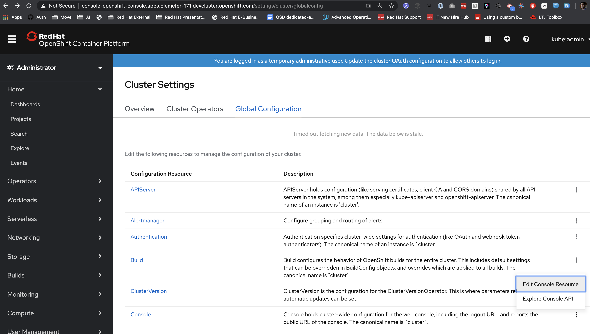

# Helm Charts in the Developer Catalog

Helm is a Kubernetes package manager.  Helm 3.0 is a major release of helm which brings in a rich set of features and addresses major security concerns around tiller.  

Red hat Openshift wants to bring Helm based content support to Openshift 4.4 Developer Catalog along with Operators to strengthen the helm based ecosystem.

## Charts in the Developer Catalog

The charts that would show up in the Developer Catalog will be powered by a [standard](https://helm.sh/docs/topics/chart_repository) helm charts' repository service.

The 'data' in the service will be backed by a Github repository of helm charts.

In the short-term, we would ship one helm charts' repository service *backed* by one public Github repository.

## How would the UI discover the charts

1. The UI would invoke `/api/console/helm/charts/index.yaml` to populate the available charts in the developer catalog. 

2. This endpoint would proxy the request to the  charts' repository service, backed by a Github repository.

In the initial phase, the charts repository service would be a served of a public Github repo.

Example, 
https://technosophos.github.io/tscharts/index.yaml is served directly off https://github.com/technosophos/tscharts . No in-cluster service will be used.

The "Red Hat" public repository that would be used is https://github.com/redhat-developer/redhat-helm-charts ( work-in-progress )

## How would disconnected installs work 

1. The user would need to 'clone' the public Github repository into her inside-the-network Github or Gitlab instance, and configure the same to serve static content ( "Pages" ).

2. The URL serving the above static content would need to be configured in the cluster's Console Settings. The value would be propagated to the console backend through an environment variable.

## How would the UI install charts

New endpoints in Console Backend that leverage the same Helm Golang APIs which the `helm install` command uses to install charts, will be introduced.

Here's how the control flow would look like:

1. The Console UI will invoke the `/api/console/helm/install` endpoint on the Console Backend. 
2. The API handler for `/api/console/helm/install` will, in turn talk to the API server ( no tiller! ) using the user's authentication, while leveraging the Helm Golang API.

This is in-line with the "Console is a pretty kubectl" philosophy since Helm itself is a thin layer on top of kubectl.

