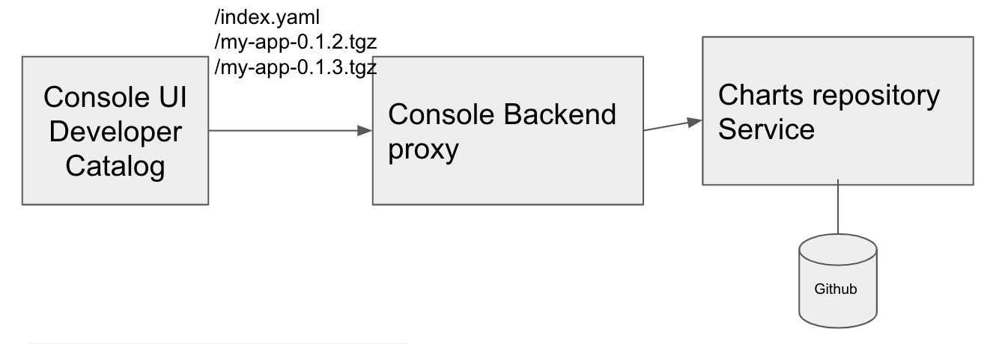

# Helm Charts in the Developer Catalog

## Release Signoff Checklist

- [ ] Enhancement is `implementable`
- [ ] Design details are appropriately documented from clear requirements
- [ ] Test plan is defined
- [ ] Graduation criteria for dev preview, tech preview, GA
- [ ] User-facing documentation is created in [openshift-docs](https://github.com/openshift/openshift-docs/)

## Summary

Managing Helm charts using the Developer perspective from DevConsole

## Motivation

Helm is a Kubernetes package manager.  Helm 3.0 is a major release of helm which brings in a rich set of features and addresses major security concerns around tiller.  

Red hat Openshift wants to bring Helm based content support to Openshift 4.4 Developer Catalog along with Operators to strengthen the helm based ecosystem.


### Goals

* Provide RESTful API for managing Helm charts and releases
* Support disconnected installs
* Support easy management of available charts, aggregation from multiple sources and filtering
  
### Non-Goals

* Infrastructure for serving the default chart repository
* Process for curating charts within the default chart repository
  
## Proposal
  
### Charts in the Developer Catalog

The charts that would show up in the Developer Catalog will be powered by a [standard](https://helm.sh/docs/topics/chart_repository) helm charts' repository service.

The default chart repository will be served from [Red Hat public GitHub repository](https://github.com/redhat-developer/redhat-helm-charts).

New charts will be added or existing curated by submitting PRs against the above GitHub repo.

### How would the UI discover the charts

1. The UI would invoke `/api/helm/charts/index.yaml` endpoint to get [the list of all available charts](https://helm.sh/docs/topics/chart_repository/#the-index-file) so that the available charts can be rendered in the developer catalog. 

2. The above endpoint would proxy requests to the configured charts repository

In the initial phase, the charts repository would be a served of [redhat-helm-charts](https://redhat-developer.github.io/redhat-helm-charts) public GitHub repo.



### How would disconnected installs work 

1. The user would need to 'clone' the content of the chart repository over the fence

   * The public GitHub repository could be cloned into inside-the-network GitHub or Gitlab instance and configured to serve static content ( "Pages" ).
   * The content of the chart repository could be crawled and served using a (containerized or external) HTTP server, e.g. nginx

2. The URL serving the above static content would need to be passed to chart repository proxy running inside the cluster. 

### Configuring Helm Chart Repository location

Configuring Helm repository location could be modeled similar to [`OperatorSource`](https://github.com/operator-framework/operator-marketplace/blob/7d230952a1045624b7601b4d6e1d45b3def4cf76/deploy/crds/operators_v1_operatorsource_crd.yaml). The resource would need to contain the following field:

```yaml
url: http://my.chart-repo.org/stable

# optional and only needed for UI purposes
displayName: myChartRepo

# optional and only needed for UI purposes
description: my private chart repo

# set to true if need to be disabled temporarly
disabled: true
```

Due to future federated usecases ([ODC-2994](https://issues.redhat.com/browse/ODC-2994))), a cluster admin should be able to declare multiple chart repositories.
Such list could be embedded (cluster-wide, top-level `Helm` resource)[https://github.com/openshift/api/tree/master/config/v1]:

```yaml
apiVersion: config.openshift.io/v1
kind: Helm
metadata:
  name: cluster
spec:
  chartRepositories:
    - url: http://my.chart-repo.org/stable
      displayName: myChartRepo
      description: my private chart repo


```

The console operator would watch for changes on it and reconfigure the chart repository proxy. The console backend already implements a few helm endpoints (including the chart proxy), but the future might require to extract them into a separate service (e.g. to make openshift more modular). Hence, it would be good to define the configuration as the top-level resource detaching API from the implementation. Cluster admin would easily discover the new resource and manage it either via CLI or through UI. 


#### Alternatives

#### 1. The configuration could be embedded into cluster-wide [`Console` config](https://github.com/openshift/api/blob/master/config/v1/types_console.go#L26)

Admins wouldn't be able to intuitively discover the operator config as a way to configure the Helm repository URLs. It becomes closely coupled with the console. Extracting Helm endpoints into a separate service would require moving the config as well.

#### 2. The configuration could be embedded into [`Console` operator config](https://github.com/openshift/api/blob/master/operator/v1/types_console.go#L26)

Conceptually, the Helm repository URL isn't really an operator configuration, hence this doesn't feel like the right place.
This approach would have similar issues with the previous alternative - admins wouldn't be able to intuitively discover the operator config as a way to configure the Helm repository URLs.

#### 3. OLM operator for Helm Configuration. 

Note, the helm charts' repository configuration today exists as a console configuration, which enables Console to proxy to the Helm chart repository URL. Moving it out of Console is outside the scope of this section. 

   * The default helm chart repository URL remains unchanged in the Console configuration.
   * Admin installs an OLM operator which only provides a `HelmConfig` cluster-scoped CRD
   * Admin creates a cluster-scoped CR. Note, this isn't very intuitive for the Admin.
   * Console-operator watches the new `HelmConfig` CR and reconciles.
   
Reflections on this approach:
* We get to avoid changes to `openshift/api`.
* However, Console operator would have to watch the `HelmConfig` CRD which it doesn't own.
* Creation of the cluster-scoped `HelmConfig` CR may not be very intuitive for the admin unless we show it in the Cluster Configuration UI in Console.
* Ideally, the operator should have been pre-installed in the cluster, but that isn't supported.

## How would the UI install charts

New endpoints in Console Backend that leverage the same Helm Golang APIs which the `helm install` command uses to install charts, will be introduced.

Here's how the control flow would look like:

1. The Console UI will create `POST` request containing appropriate JSON payload against `/api/helm/release` endpoint on the Console Backend. 
2. The API handler for the given endpoint will, in turn talk to the API server (no Tiller in Helm3) using the user's authentication, while leveraging the Helm Golang API.

This is in-line with the "Console is a pretty kubectl" philosophy since Helm itself is a thin layer on top of kubectl.


