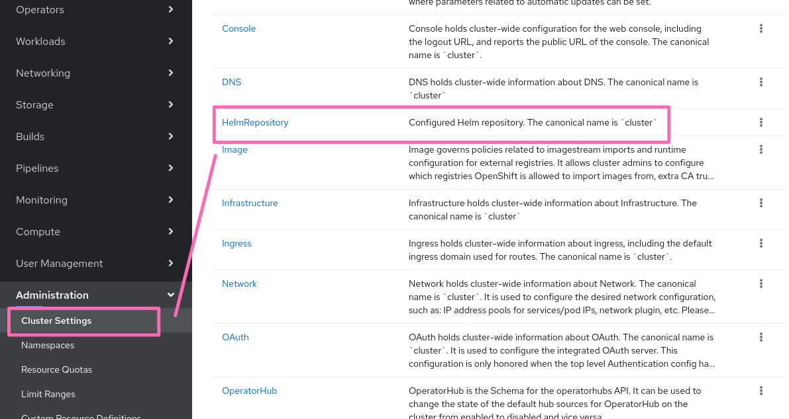

# Helm Charts in the Developer Catalog

## Release Signoff Checklist

- [ ] Enhancement is `implementable`
- [ ] Design details are appropriately documented from clear requirements
- [ ] Test plan is defined
- [ ] Graduation criteria for dev preview, tech preview, GA
- [ ] User-facing documentation is created in [openshift-docs](https://github.com/openshift/openshift-docs/)

## Summary

Managing Helm charts using the Developer perspective from DevConsole

## Motivation

Helm is a Kubernetes package manager.  Helm 3.0 is a major release of helm which brings in a rich set of features and addresses major security concerns around tiller.  

Red hat Openshift wants to bring Helm based content support to Openshift 4.4 Developer Catalog along with Operators to strengthen the helm based ecosystem.


### Goals

* Provide RESTful API for managing Helm charts and releases
* Support disconnected installs
* Support easy management of available charts, aggregation from multiple sources and filtering
  
### Non-Goals

* Infrastructure for serving the default chart repository
* Process for curating charts within the default chart repository
  
## Proposal
  
### Charts in the Developer Catalog

The charts that would show up in the Developer Catalog will be powered by a [standard](https://helm.sh/docs/topics/chart_repository) Helm chart repository instance.

In the initial phase, the chart repository would be served of [redhat-helm-charts](https://redhat-developer.github.io/redhat-helm-charts) public [GitHub repository](https://github.com/redhat-developer/redhat-helm-charts).

New charts will be added and/or existing curated by submitting PRs against the above mentioned GitHub repository.

### How would the UI discover the charts

1. The UI would invoke `/api/helm/charts/index.yaml` endpoint to get [the repository index file](https://helm.sh/docs/topics/chart_repository/#the-index-file) so that the available charts can be rendered in the developer catalog. 

2. The above endpoint would proxy requests to the configured chart repository


### How would disconnected installs work 

1. The user would need to 'clone' the content of the chart repository over the fence

   * The public GitHub repository could be cloned into inside-the-network GitHub or Gitlab instance and configured to serve static content ( "Pages" ).
   * The content of the chart repository could be crawled and served using a (containerized or external) HTTP server, e.g. nginx

2. The URL serving the above static content would need to be passed to chart repository proxy running inside the cluster. 

### Configuring Helm Chart Repository location

Configuring Helm repository location could be modeled similar to [`OperatorSource`](https://github.com/operator-framework/operator-marketplace/blob/7d230952a1045624b7601b4d6e1d45b3def4cf76/deploy/crds/operators_v1_operatorsource_crd.yaml). 
Due to future planned federated usecases ([ODC-2994](https://issues.redhat.com/browse/ODC-2994)), a cluster admin should be able to declare multiple chart repositories.

To achieve that, one or more cluster-scoped, top-level `HelmChartRepository` resources should be added:

```yaml
apiVersion: helm.kubernetes.io/v1
kind: HelmChartRepository
metadata:
  name: cluster
spec:
  url: http://my.chart-repo.org/stable

  # optional and only needed for UI purposes
  displayName: myChartRepo

  # optional and only needed for UI purposes
  description: my private chart repo

  # set to true if need to be disabled temporarly
  disabled: true
```

An operator would watch for changes on them and reconfigure the chart repository proxy. 

Please note that, the console backend already implements a few helm endpoints (including the chart proxy).
In future, we could extract them into a separate service to make the functionality more modular.
Hence, it would be good to define the configuration as the top-level Kubernetes resource thereby decoupling the API contract from the scenario-specific implementations. Cluster admin would easily discover the new resource and manage it either through UI:



or via CLI:

```shell
$ oc get helmchartrepositories
NAME          AGE
cluster       3h30m
```

In a case of multiple chart repositories, the console should be modified so that either allow:
* editing all chart repository instances at once through aggregated YAML document
* add/edit/removal of individual instances


Adding an additional chart repositories via CLI follows the usual k8s pattern:

```shell
$ cat <<EOF | oc apply -f -
apiVersion: helm.kubernetes.io/v1
kind: HelmChartRepository
metadata:
  name: stable
spec:
  url: https://kubernetes-charts.storage.googleapis.com

  displayName: Public Helm stable charts

  description: Public Helm stable charts hosted on HelmHub
---
apiVersion: helm.kubernetes.io/v1
kind: HelmChartRepository
metadata:
  name: incubator
spec:
  url: https://kubernetes-charts-incubator.storage.googleapis.com

  displayName: Public Helm charts in incubator state
EOF 

$ oc get helmchartrepositories
NAME          AGE
cluster       3h30m
stable        1m
incubator     1m
```

Chart repository proxy will use all configured chart repositories and deliver to the UI an aggregated index file. If needed by some future usecase, UI would be able read helm chart repository configuration and perhaps even talk to the individual chart repositories directly.

Managing Helm releases via CLI could also benefit from the in-cluster stored chart repository configurations. If `HelmChartRepository` CRD includes all the fields from [Helm Repository Entry struct](https://github.com/helm/helm/blob/master/pkg/repo/chartrepo.go#L42), then the repositories declared in the cluster could be automatically used, without the need to issue `helm repo add` locally. These repositories will be shared across all developers accessing the cluster.

Given the above example, the interaction could look like this:

```shell
$ oc get helmchartrepositories
NAME          AGE
cluster       3h30m
stable        1m
incubator     1m

# repositories configured in the cluster are implicitelly available for CLI as well
$ helm repo list
NAME     	URL
cluster   http://my.chart-repo.org/stable
stable   	https://kubernetes-charts.storage.googleapis.com           
incubator	https://kubernetes-charts-incubator.storage.googleapis.com

# install a chart from stable repo defined in the cluster
$ helm install mysql stable/mysql
```

Currently Helm manages chart repository configurations in the local file only.
The proposed `HelmChartRepository` CRD does not depends on any OpenShift API, giving us an opportunity to
to submit it and the work related to its consumption to the Helm project. In a separate upstream proposal, we shall propose making the CLI cluster-aware with respect to the chart repositories. `helm repo list` would not only list local file system configuration, it would also show us chart repositories represented as Kubernetes resources in the cluster.

#### Known In-Cluster Representations of Chart Repositories

[Open Cluster Management project](https://github.com/open-cluster-management/multicloud-operators-subscription) introduced a notion of subscription for [a Helm chart](https://github.com/open-cluster-management/multicloud-operators-subscription/tree/master/examples/helmrepo-channel). A subscription is defined on the top of a channel of [type `HelmRepo`](https://github.com/open-cluster-management/multicloud-operators-subscription/blob/master/examples/helmrepo-channel/01-channel.yaml). Currently, chart repo configuration is provided in a separate `ConfigMap`, but the model could be extended to uses the configuration provided in referred `HelmChartRepository` instance.

#### Alternatives

#### 1. The configuration could be embedded into cluster-wide [`Console` config](https://github.com/openshift/api/blob/master/config/v1/types_console.go#L26)

Admins wouldn't be able to intuitively discover the operator config as a way to configure the Helm repository URLs. It becomes closely coupled with the console. Extracting Helm endpoints into a separate service would require moving the config as well.

#### 2. The configuration could be embedded into [`Console` operator config](https://github.com/openshift/api/blob/master/operator/v1/types_console.go#L26)

Conceptually, the Helm repository URL isn't really an operator configuration, hence this doesn't feel like the right place.
This approach would have similar issues with the previous alternative - admins wouldn't be able to intuitively discover the operator config as a way to configure the Helm repository URLs.

#### 3. OLM operator for Helm Configuration. 

Note, the Helm chart repository configuration today exists as a console configuration, which enables Console to proxy to the Helm chart repository URL. Moving it out of Console is outside the scope of this section. 

   * The default helm chart repository URL remains unchanged in the Console configuration.
   * Admin installs an OLM operator which only provides a `HelmChartRepository` cluster-scoped CRD
   * Admin creates a cluster-scoped CR. Note, this isn't very intuitive for the Admin.
   * Console-operator watches the new `HelmChartRepository` CR and reconciles.
   
Reflections on this approach:
* We get to avoid changes to `openshift/api`.
* However, Console operator would have to watch the `HelmChartRepository` CRD which it doesn't own.
* Creation of the cluster-scoped `HelmChartRepository` CR may not be very intuitive for the admin unless we show it in the Cluster Configuration UI in Console.
* Ideally, the operator should have been pre-installed in the cluster, but that isn't supported.

## How would the UI install charts

An endpoint that leverages the same Helm Golang APIs which the `helm install` command uses to install charts, will be introduced.

Here's how the control flow would look like:

1. The Console UI will create `POST` request containing appropriate JSON payload against `/api/helm/release` endpoint. 
2. The API handler for the given endpoint will, in turn talk to the API server (no Tiller in Helm3) using the user's authentication, while leveraging the Helm Golang API.

This is in-line with the "Console is a pretty kubectl" philosophy since Helm itself is a thin layer on top of kubectl.


